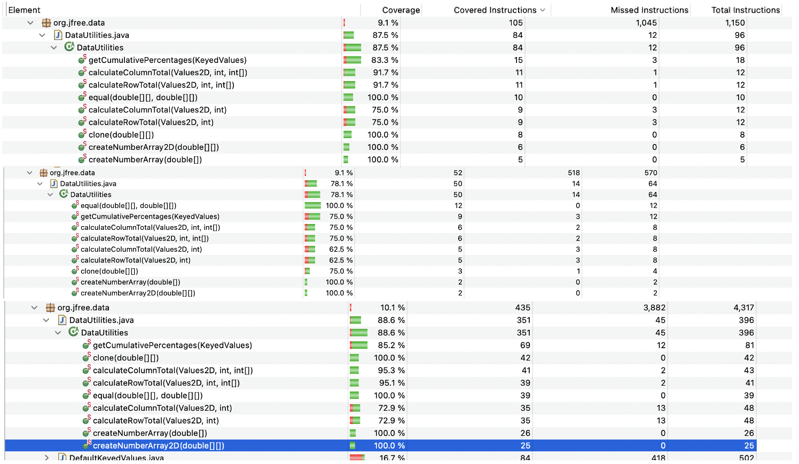
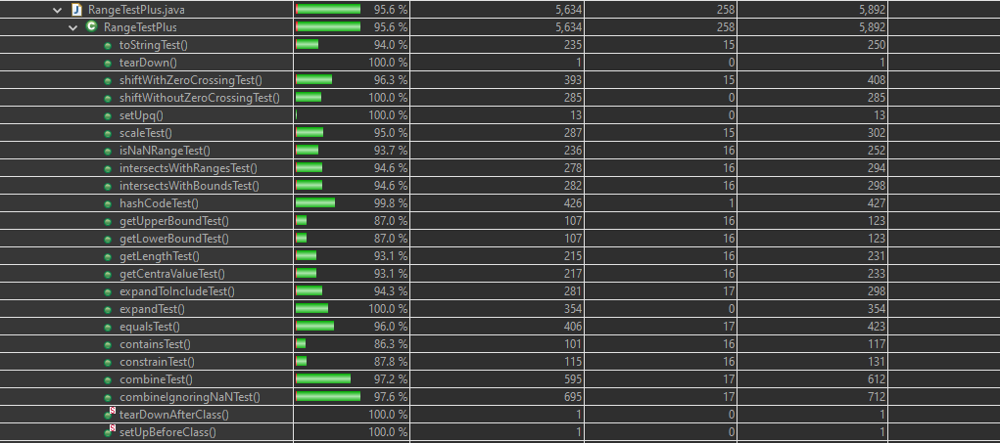
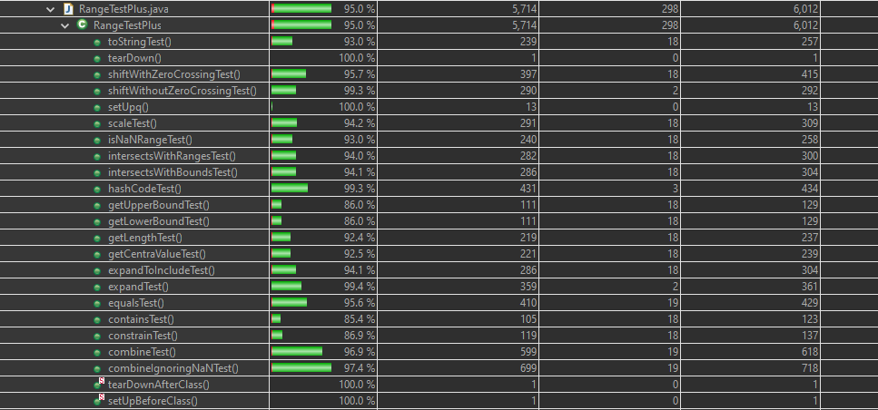

**Lab. Report #3 – Code Coverage, Adequacy Criteria and Test Case Correlation**

| Group \#:      |  16 |
| -------------- | --- |
| Student Names: |  Carter Marcelo	|
		 |  Karim Mansour	|
		 |  Ethan Winters	|
		 |  Jason Pang		|

(Note that some labs require individual reports while others require one report
for each group. Please see each lab document for details.)

# 1 Introduction

Similar to the previous assignment there is a focus on using JUnit to test the system JFreeChart. The focus of this lab was to better understand White-Box testing by performing unit testing using JUnit. Additionally there is also a focus on using Java Code covering, our choice was to use EclEmma. 

# 2 Manual data-flow coverage calculations for X and Y methods

DataUtilities: 100(3)+75(2)+100+91.7(2)+83.3+100+75(3)+62.5(2)+75+100(2)+100(2)+72.9(2)+100+95.1+95.3+100+85.2 = 2363.1 / 27 = 87.5% 

Range: 100(2)+97.6+97.2+87.8+86.3+96+100+94.3+93.1(2)+87(2)+99.8+94.6+93.7+95+100(2)+96.3+100+94+93+100+95.7+99.3+100+94.2+93+94+94.1+99.3+86(2)+92.4+92.5+94.1+99.4+95.6+85.4+86.9+96.9+97.4+100(2) = 4362.6 / 46 = 94.8%

# 3 A detailed description of the testing strategy for the new unit test

This new strategy involves the use of various tests that span the entire scope of a function. An example of this strategy can be seen heavily in the testDataUtilitiesEqualMethod series of tests, where various edge cases and conditional cases are tested. This ensures a high level of coverage for these methods. Methods within the Range class are focused on covering all methods of the class. These provide great coverage and ensure all operations are tested. 

# 4 A high level description of five selected test cases you have designed using coverage information, and how they have increased code coverage

TestCalculateRowTotalTwoArguments(): This test calculates the total sum of columns for two arguments in the column. It uses a mock object to run this test and then compares the actual result to a hard-coded expected result. 
TestCalculateRowTotalThreeArgs(): This test works much like the above test but with 3 arguments in total. It tests the calculation and checks if the sum matches. It also catches exceptions 
TestdataUtilitiesEqualMethodForDifferentCols2DArrays(): This test creates two test matrices, one of 2x3 and one of 2x2. It then performs operations to make them unequal and compares them to ensure this. 
TestDataUtilitiesEqualsMethod4(): This works similar to the above test yet instead works with one 2x2 matrix and one 3x3 one. 
TestDataUtilitiesEqualsMethod5(): This works similar to the TestdataUtilitiesEqualMethodForDifferentCols2DArrays() test, yet uses one null array. 

These tests have increased the coverage of the code by testing various conditions the methods could encounter, such as different sized arrays and null entities. This is useful in preventing errors due to unforeseen circumstances or strange cases in the actual data these methods will receive. 

# 5 A detailed report of the coverage achieved of each class and method (a screen shot from the code cover results in green and red color would suffice)

# 6 Pros and Cons of coverage tools used and Metrics you report

The use of Eclemma proves positive for ensuring coverage of various logical cases that differ, such as testing 2x2 and 2x3 matrices in the example of TestDataUtilitiesEqualsMethod4(). It allows easy tracking of all the test cases and possibilities, though provides some drawbacks with regards to numerical values. Instances where numerical values may have impact, such as decimal values and prime numbers may not be covered automatically by Eclemma though may have significant impact on some test cases. The metrics of these tests showcase great adequacy in achieving high coverage of the code being tested here. They highlight which tests may be having issues because of missed instructions. The drawback to this is the inability to know which specific instructions are failing, which makes it difficult to fix any underlying problems to work towards 100% coverage. 

# 7 A comparison on the advantages and disadvantages of requirements-based test generation and coverage-based test generation.

Some of the advantages of Requirements-based Test Generation include being well-defined. Having the tests being clear and well-defined allows the tests to be conducted more accurately. It also allows developers to more easily create tests because they know the requirements from the beginning. Some disadvantages would be a limited scope, if the requirements are not detailed enough it could lead to cases not being fully covered. 

Coverage-based test Generation has both advantages and disadvantages that Requirement-based test Generation have. For insistence Coverage-based testing covers all parts of the code that are tested, this is an advantage over Requirement-based testing because Requirement-based testing has the potential to miss some cases. Some disadvantages of Coverage-based testing would be tools themselves, as most tools are limited to unit testing. As well as comparing results between tools is not possible as different tools use different methodology. 

# 8 A discussion on how the team work/effort was divided and managed

The balance of work here was distributed evenly across the team, with the tests and lab report questions balanced evenly across the four of us. This allowed us to each understand what was occurring and contribute evenly. 

# 9 Any difficulties encountered, challenges overcome, and lessons learned from performing the lab

One major difficulty with this exercise was determining the correct tests to construct and how to ensure all cases, such as those with unusual circumstances that could be seen during normal operation. Another challenge encountered was determining every possible value to test every function. As different functions being tested require different values to be entered. However, a great lesson on data coverage was learned in this lab through the design of these tests, which will allow us to better design future tests to fit the code in test even better to ensure all possible entries and cases are covered. 

# 10 Comments/feedback on the lab itself

This lab document proved easy to follow and work with to construct tests and produce an effective lab report
</pre></body></html>
